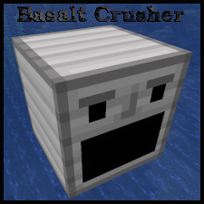

# Basalt Crusher
Vanilla friendly fabric mod to make basalt great again.

## Once Upon a Time in IRC...
&lt;@jyasu&gt; It's possible they don't spawn in basalt deltas and in the quadrant I'm exploring, I keep hitting an awful lot of basalt deltas. A lot more than we've seen in survival2.  
&lt;@jacob&gt; Ugh, basalt  
&lt;@jyasu&gt; So, I don't use it for anything except the pillars in my nether tunnels.   
&lt;@jyasu&gt;And honestly the only reason I use it there is I had to do *something* with the stuff and the aesthetic kinda works there.  
&lt;@jacob&gt; Time for a new mod: Basalt Crusher, which just grinds basalt and outputs gravel!  
&lt;@jacob&gt; ... actually that'd be really easy to make  
&lt;@jyasu&gt; Hardest part is the graphics.

## What does this thing even do?
At present, just one thing.  You feed it consumable jaw liners and any kind
of basalt and it gives you back sweet, sweet gravel.

I wanted this mod to fit in with a fairly minimalist Vanilla aesthetic.  It
does just one thing in what I think is a pretty Vanilla way.  And if you
want a lot of gravel you are going to need an iron farm.  The iron jaw
liner will crush 250 basalt blocks at a cost of 31 iron ingots.  (Late game,
there are options to increase the output quite a bit...)

## Why are there two jaw liner slots?
The mod is intended to allow the user to input a stack of jaw liners to the
left slot and have them move one at a time to the right slot where they get
damaged.  However, so far the only way I have found to do this is with two
different items per jaw liner.  If I figure out a better way, that's how it
will work.  If not, I'll rework the GUI once I've given up.
